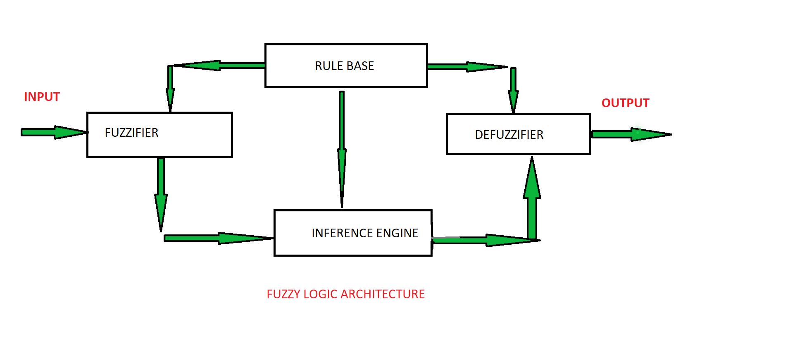
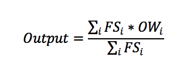
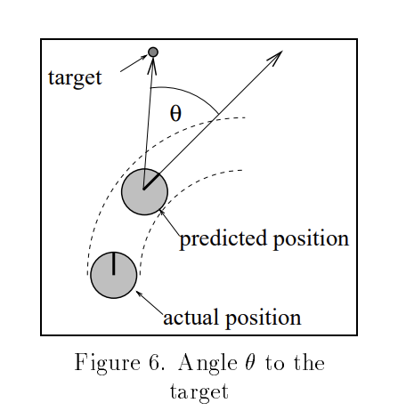
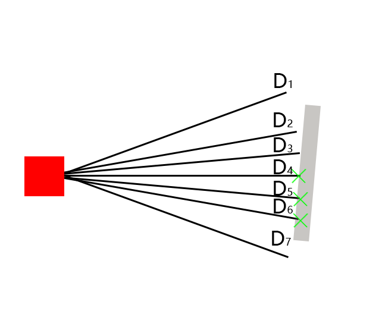
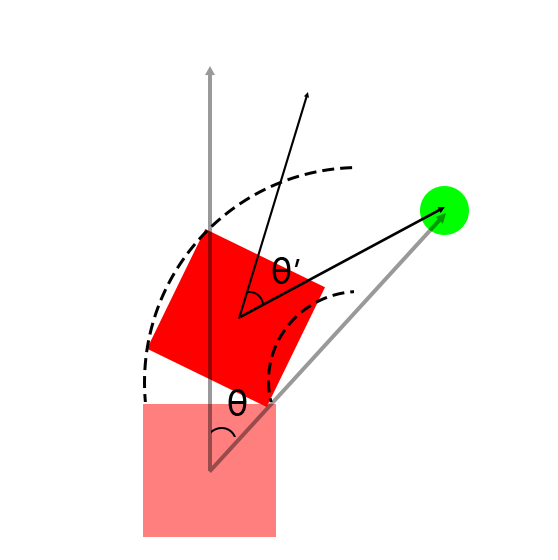
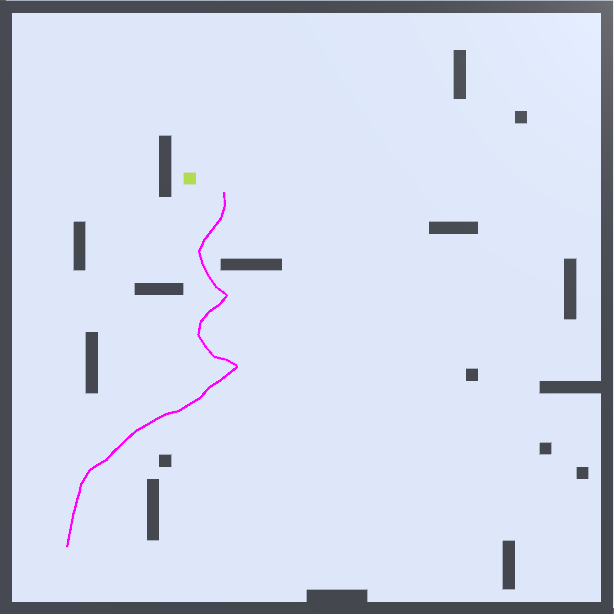

```{r setup, include=FALSE}
options(htmltools.dir.version = FALSE, htmltools.preserve.raw = FALSE)
```

```{r xaringan-all, echo=FALSE, include=FALSE}
library(countdown)
library(xaringan)
library(xaringanExtra)
library(knitr)

hook_source <- knitr::knit_hooks$get('source')
knitr::knit_hooks$set(source = function(x, options) {
  x <- stringr::str_replace(x, "^[[:blank:]]?([^*].+?)[[:blank:]]*#<<[[:blank:]]*$", "*\\1")
  hook_source(x, options)
})

xaringanExtra::use_broadcast()
xaringanExtra::use_freezeframe()
xaringanExtra::use_scribble()
xaringanExtra::use_search(show_icon = TRUE, auto_search	=FALSE)
xaringanExtra::use_freezeframe()
xaringanExtra::use_clipboard()
xaringanExtra::use_tile_view()
xaringanExtra::use_panelset()
xaringanExtra::use_editable(expires = 1)
xaringanExtra::use_fit_screen()
xaringanExtra::use_extra_styles(
  hover_code_line = TRUE,         
  mute_unhighlighted_code = TRUE  
)

```

# Contents

## 1. Introduction

## 2. System structure

## 3. Reflection

---
# Introduction I

## Fuzzy Logic

- Components: fuzzifier, rules, an inference engine, and a defuzzifier

<br/>

```{r  echo=FALSE, out.width='80%', fig.align='center'}

```
.normal-font[
Source: [Fuzzy Logic (Surya, 2023)](https://www.geeksforgeeks.org/fuzzy-logic-introduction/)
]
---
# Introduction I: Fuzzy Logic

## In-detail
.panelset[
.panel[.panel-name[**Fuzzy sets**]

- Decision: Whether the robot should brake

- Speed: {Fast, Normal, Slow}

- Distance to front obstacle: {Far, Mid, Close}

- Final output threshold = 5

<br/>

Bounded sum (symmetric set difference): 
$$ \mu A \oplus B (x) = min (1, \mu A (x) + \mu B (x) )  $$

]
.panel[.panel-name[**Fuzzyfication**]
- Input: Current robot speed: 5.6; Distance: 1

- Output:
  
  - Speed: {Fast: 0.1, Normal: 0.6, Slow: 0.3}
  - Distance to front obstacle: {Far: 0, Mid: 0.2, Close: 0.8}

]
.panel[.panel-name[**Rule Base**]
- Fire Strength(FS)

  - Slow and Far = Max( 0.3, 0 ) = 0.3
  
  - Slow and Mid = 0.3
  
  - SC = 0.8
  
  - ...

]
.panel[.panel-name[**De-fuzzyfication**]

.pull-left[
#### Weighted average decision method

- FS (Fire Strength)

- OW (Output Wight): each degree has a weight
<br/>

Final output = 7.85 > 5 => Should break
]

.pull-right[
```{r  echo=FALSE, out.width='80%', fig.align='center'}

```
]
]
]
---
# Introdcution II

## Dynamic Window Approach

$$ G(v, \omega) =  \sigma(\alpha \cdot heading + \beta \cdot dist + \gamma \cdot velocity) $$

.pull-left[
- objective function
  
  - Target heading: The Angle between the robot's current attitude direction and the target direction
  
  - Clearance: 'dist' is the distance of the nearest obstacle intersecting the arc of the robot's motion trajectory
  
  - Velocity
]

.pull-right[
```{r  echo=FALSE, out.width='70%', fig.align='center'}

```
]

.normal-font[
Source: [Dynamic window approach (Fox et al.)](https://ieeexplore.ieee.org/iel1/100/12589/00580977.pdf?casa_token=gQZ8A8c7GXEAAAAA:5zmxG14BWkmFAs1BHm4qxYZRk9n0rv_Eqqn3AxY1NruZrP9Fo8SlMFo0875U7vZ4t6aDI29xNw)
]
---
# Introdcution II: DWA

<p align="center"><iframe width="560" height="315" src="./assets/ros.mp4" title="DWA algorithm simulates video player" frameborder="0" allow="accelerometer; autoplay; clipboard-write; encrypted-media; gyroscope; picture-in-picture" allowfullscreen></iframe></p>


<br/>

.normal-font[
Source: [DWA algorithm simulate (AtsushiSakai, 2020)](https://github.com/AtsushiSakai/PythonRobotics/tree/master/PathPlanning)
]

---
# System Structure

#### 1. Aims to decrease the cost that will be used to guide the robot

- Built on unity develpoment platform

- Simplified movement

- Equiped with one camer and Lidar

#### 2. Maintain a relatively reliable accuracy

- Known target location

- Obstacles with fixed height

---
# System Structure: Robot

- Each line $D_{n}$ represents a LiDAR detection result in current state

- The green cross-hire means detected front obstacle

```{r  echo=FALSE, out.width='70%', fig.align='center'}

```

---
# System Structure: Algorithm

.pull-left[
1. Generate turning angles and speed array by current angle between the moving direction and the target point and robot velocity

1. Evaluate the array combines with current situation
$$ E = \alpha \cdot movement + \beta \cdot heading + \gamma \cdot obstacle  $$

1. Pick best angle and speed and convert them to turning and acceleration (deceleration) commands
]

.pull-right[
```{r  echo=FALSE, out.width='75%', fig.align='center'}

```
]
---
# Results

- Smooth turn

- Obstacle avoidance


```{r  echo=FALSE, out.width='50%', fig.align='center'}

```
---
# Conclusion and Limitation

- ### Tested exclusively in flat environments.

- ### The camera's power is often underestimated.

- ### The system's frame rate affects the outcome.

- ### Increasing the map's complexity can cause instability.

---
# References

```{r, load_refs, echo=FALSE, warning=FALSE}
library(RefManageR)
bib <- ReadBib("./pre.bib", check = FALSE)
ui <- "- "
```

```{r, print_refs, results='asis', echo=FALSE, warning=FALSE, message=FALSE}
writeLines(ui)
print(bib[key = "bai2006fundamentals"], 
  .opts = list(check.entries = FALSE, 
               style = "html", 
               bib.style = "authoryear"))
writeLines(ui)
print(bib[key = "fox1997dynamic"], 
  .opts = list(check.entries = FALSE, 
               style = "html", 
               bib.style = "authoryear"))
writeLines(ui)
print(bib[key = "Sakai_PythonRobotics_PathPlanning"], 
  .opts = list(check.entries = FALSE, 
               style = "html", 
               bib.style = "authoryear"))
writeLines(ui)
print(bib[key = "Geek_2023"], 
  .opts = list(check.entries = FALSE, 
               style = "html", 
               bib.style = "authoryear"))
```

---

class: center, middle

# Thanks!

Slides created via the R package [**xaringan**](https://github.com/yihui/xaringan).
